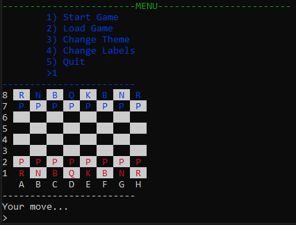
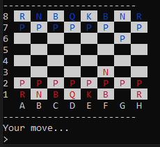

# Description 
This is a personal python project for learning purposes. 

The goal is to be able to play chess in the terminal against a chess-bot (see pictures below). Functionality for this game should be to:
1. Save games locally to disk / boot saved games during runtime.
2. Use an SQL database to recognize user details.
3. Change chessbot difficulty.  

---

# How to Run
1. Install the latest version of [python](https://www.python.org/downloads/) 
2. Run main.py OR download the executable (TBD)  

## How to Play
When you run main.py, you should be greeted by a menu; from here you can load any saved games, change the theme, or toggle the side labels on the board.

## Making a Move
To be able to play, you'll have to be comfortable with some basic [algebraic chess notation](https://en.wikipedia.org/wiki/Algebraic_notation_(chess)).

From here, all you have to do is enter the move you wish to play and the computer will automatically reply with a countermove.

**Known Bugs**
1. Lots of edge cases still need to be tested...

