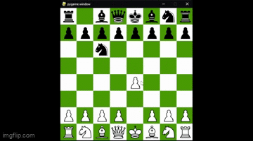

# Chess Engine + ChessBot A.I.
## Description 
This is a personal python project for learning purposes.  
## Deliverables  

1. Play against the computer (a chess bot), where the bot reflects novice play.
2. Provide an intuitive user interface using pygame
3. Minimize runtime delay by running asynchronous processes.

# How to Run
1. Install the latest version of [python](https://www.python.org/downloads/) 
2. Install the latest version of [pygame](https://www.pygame.org/download.shtml)
3. Run 'UserInterface.py'

## Algorithm References 
[1] https://www.chessprogramming.org/Minimax  
[2] https://www.chessprogramming.org/Negamax  
[3] https://en.wikipedia.org/wiki/Alpha%E2%80%93beta_pruning

